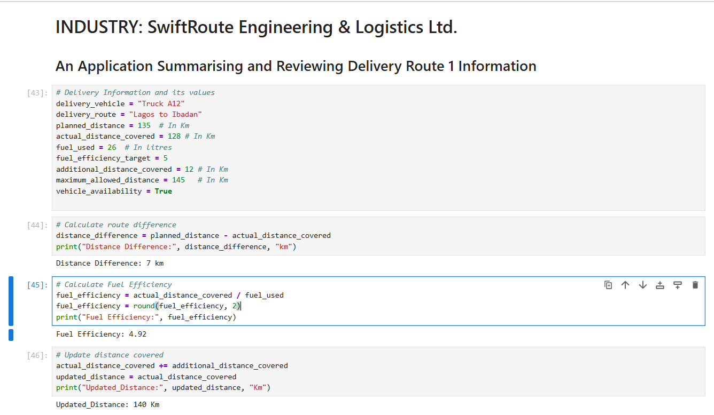
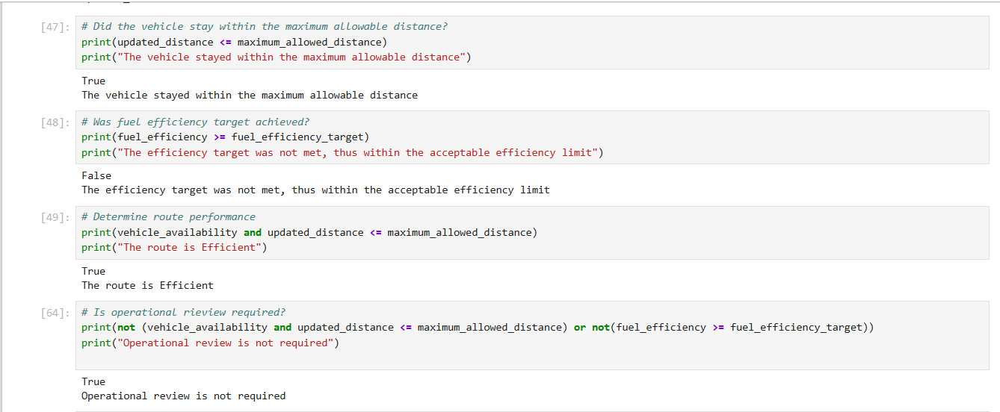
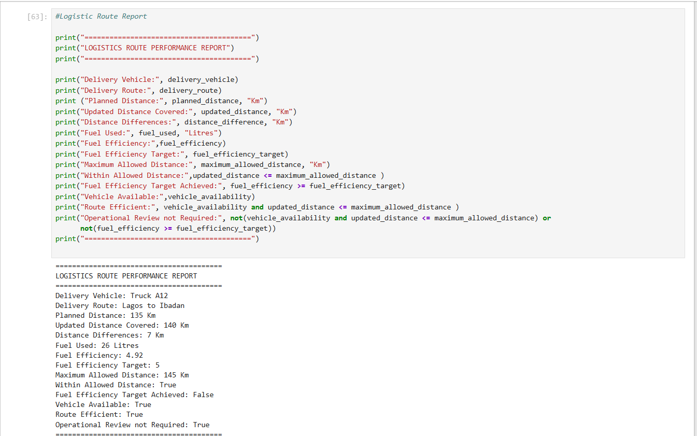
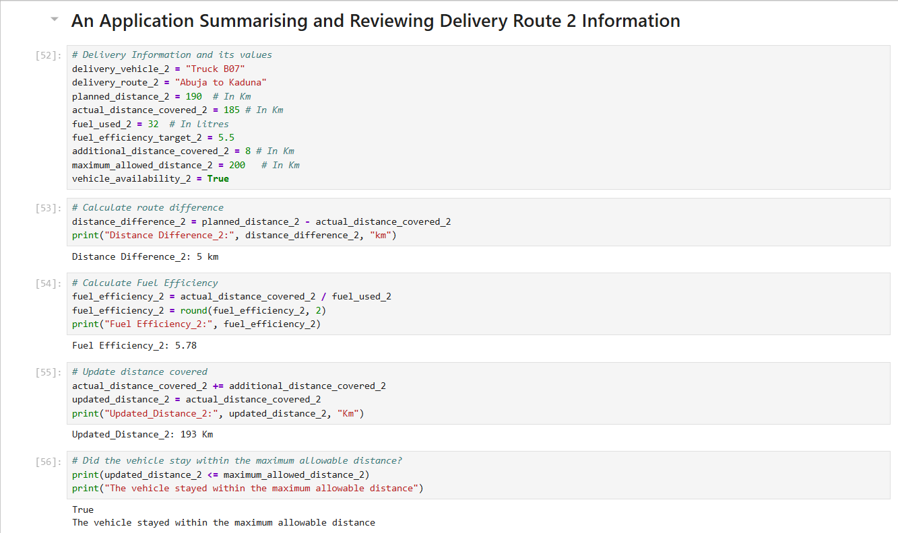
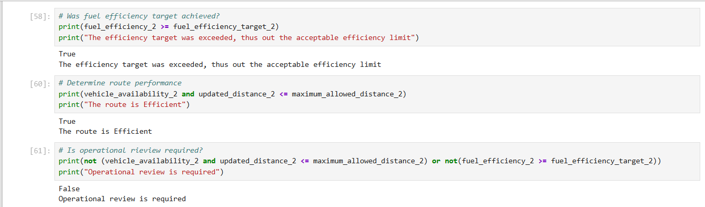
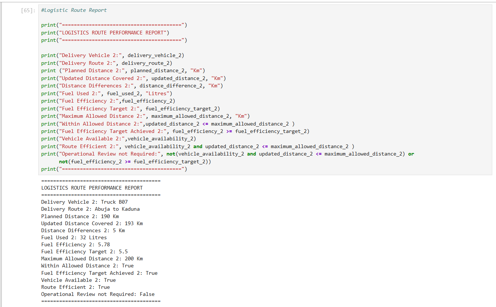
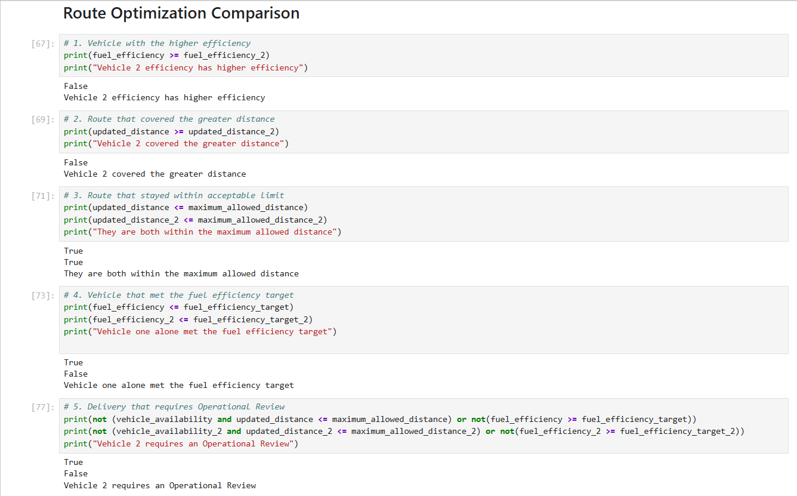
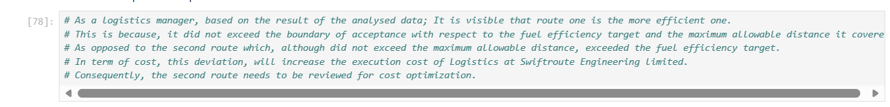

# Logistic-Route-Optimizer
## Introduction
The Logistics Route Optimizer is a Python application built for SwiftRoute Engineering &amp; Logistics Ltd. to streamline daily fleet reporting, monitor fuel consumption, and evaluate route efficiency.

## The Problem Statement
In fast-paced logistics operations, fleet managers face challenges in manually tracking delivery routes, identifying fuel inefficiencies, and evaluating distance discrepancies caused by unexpected road diversions[cite: 1]. Manual reporting is prone to errors, delays, and inconsistent evaluations, making it difficult to flag high-cost routes that require immediate operational intervention[cite: 1].

## The Solution
To address this, a Python-based operational tool was built to automate daily route summaries[cite: 1]. The script takes raw delivery operational parameters, calculates actual performance metrics, checks compliance against operational targets, and automatically determines whether a route requires operational review[cite: 1, 2].

## Why the Problem is Important
Optimizing route efficiency and tracking fuel consumption directly impact a logistics firm's bottom line[cite: 1]. Unmonitored route diversions and poor fuel efficiency lead to higher execution costs and reduced margins[cite: 2]. Automated operational reporting gives fleet managers immediate visibility to optimize costs and improve fleet reliability[cite: 1].

## Technologies Used
* **Python 3**[cite: 2]
* **Jupyter Notebook** (IDE)[cite: 2]

## Python Concepts Used
Built strictly using fundamental Python building blocks (Lessons 1–5) without using conditional statements (`if/else`), loops, or external libraries[cite: 1]:
* **Variables & Data Types**: Storing strings, integers, floats, and booleans for fleet attributes[cite: 1, 2].
* **Arithmetic Operators**: Calculating route variances and fuel efficiency[cite: 1, 2].
* **Assignment Operators**: Dynamically updating actual distance covered after road diversions (`+=`)[cite: 1, 2].
* **Comparison Operators**: Checking distance thresholds (`<=`) and target efficiency (`>=`)[cite: 1, 2].
* **Logical Operators**: Evaluating complex performance rules (`and`, `or`, `not`)[cite: 1, 2].

## Project Workflow
1. **Data Ingestion**: Initialize operational delivery parameters for assigned vehicles[cite: 1, 2].
2. **Metric Calculation**: Compute route distance differences and real-time fuel efficiency[cite: 1, 2].
3. **Route Distance Update**: Apply unexpected diversion mileage to actual distance using assignment operators[cite: 1, 2].
4. **Condition Evaluation**: Evaluate distance compliance and target efficiency using comparison and logical operators[cite: 1, 2].
5. **Report Generation**: Format and print a standardized performance report summarizing operational findings[cite: 1, 2].

## Project Screenshots

### Route Performance Output

## Results
The program successfully processed daily operations for test delivery corridors[cite: 1, 2]:
* **Truck A12 (Lagos to Ibadan)** stayed within maximum distance constraints (140 km / 145 km) but fell slightly short of its target fuel efficiency (4.92 / 5.00 km/l)[cite: 1, 2].
* **Truck B07 (Abuja to Kaduna)** exceeded its raw fuel efficiency target (5.78 / 5.50 km/l) and stayed within maximum distance limits (193 km / 200 km)[cite: 2].

## Key Findings
* Automated boolean logic reliably flags routes requiring manager review without human calculation errors[cite: 1].
* Even minor fuel efficiency shortfalls across continuous routes compound into significant operational costs for the fleet over time[cite: 2].

## Key Learnings
* **Logic over Complexity**: Complex conditional structures (`if/else`) aren't always necessary; comparison and logical operators can evaluate complex business logic directly[cite: 1].
* **Data to Insight**: Raw numbers become actionable business decisions when structured into clear operational reports[cite: 1].
* **Domain Context**: Software development in logistics requires thinking beyond code to consider operational constraints, fuel targets, and cost impacts[cite: 1, 2].
